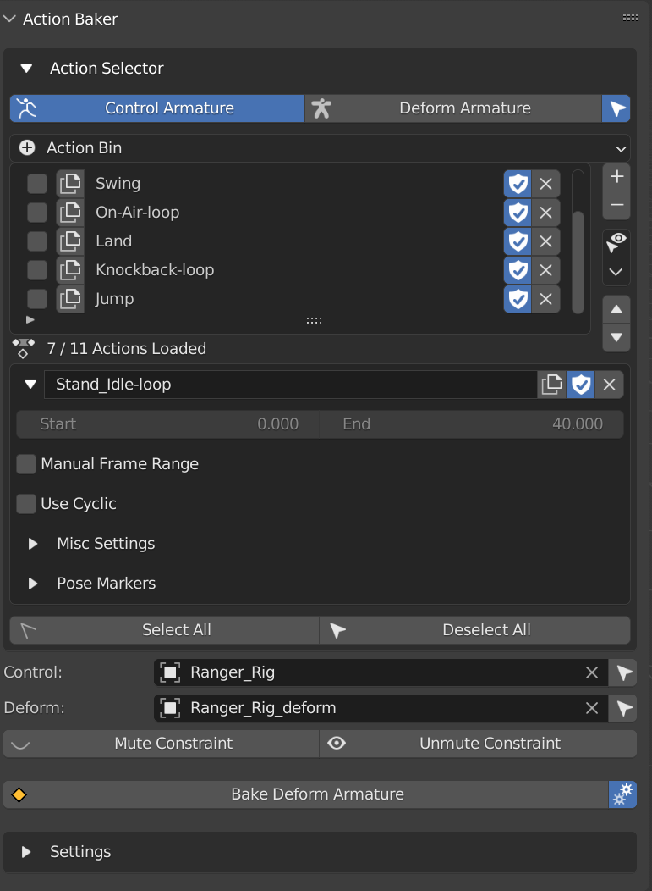

Action Baker
------------

A Tool that Helps Bake Animation From Control Rig to Deform Rig using `CGDive's <https://www.youtube.com/c/CGDive/videos>`_ Workflow.  

This Feature is Made to Work Together with `Game Rig Tools <https://www.youtube.com/watch?v=iZBx1I7vmQ0>`_ and is similar to Game Rig Tool's Action Bakery. 

While It might have other application, this tool is Specifically Made for CGDive workflow, but the Frame Ranger way. 

.. note::
  The Difference between `Game Rig Tools <https://www.youtube.com/watch?v=iZBx1I7vmQ0>`_ Action Bakery and Frame Ranger's Action Baker is that it takes advantage of the Object Action Manager in Frame Ranger For Better Action Organization. 

Action Selector 
+++++++++++++++

This Shows The Action List Of your Control Armature and Deform Armature for easy Access, the little select Icon Next to the Tab Allows Blender to Select the Armature When Switching Tabs

It Operates the Same as Object Action Manager, Except it is Placed More Conviniently Base on what you Input in Control Armature and Deform Armature

The Purpose of this is to Allow you to Select Action Without Finding the Object in the Scene, as well as inspect the deform armature's action

**Select All**: Select All Action

**Deselect All**: Deselect All Action

Armature Input
+++++++++++++++

**Control Armature**: Control Armature that Controls the Deform Armature

**Deform Armature**: Deform Armature that is Controlled by Control Armature, It is Usually Generated By Game Rig Tools From the Control Armature

Constraint
+++++++++++++++

**Mute Constraint**: Mute All Constraint On Deform Armature, Free it From Control Armature 

**Unmute Constraint**: Unmute All Constraint On Deform Armature, Making it Control by Control Rig Again

Bake Deform Armature
++++++++++++++++++++

Start Baking Selected Actions

Check Below For Information About The Settings

.. note::

   The Settings in the Popup is the Same As in the Panel, it just popup to make sure you check the settings before baking. 

   You can Disable the Popup by turn off the cog icon next to bake deform armature

Settings
++++++++++++++++++++

Settings Used for Baking the Deform Armature

**Rename Settings**

  **Rename Mode**: Method of Renaming Baked Action
    
    - Prefix: Prepend String A to the Action Name

    - Suffix: Append String A to the Action Name

    - Replace: Find String A And Replace with String B in Action Name

  **String A**: Use For Prefix, Suffix, or Find

  **String B**: Use For Replace, Only Appear in Replace Rename Mode 

  **Use Bake Name When Available**: Use Action's Bake Name in Misc Settings if not empty

**Basic Settings**
  
  **Overwrite**: Overwrite Action if the Target Action Name Exist 

  **Post Mute Constraint**: Mute Constraint On Deform Armature to Free its Control from Control Armature After Baking

  **Pre Unmute Constraint**: Unmute Constraint On Deform Armature to Control by Control Armature so that the Movement is baked from control armature 

  **Push To NLA**: Push Action to NLA After Bake

  **Preclear NLA**: Only Appear if Push to NLA

    - Skip Push if Exist: Skip on Pushing this action to NLA if it is already in NLA

    - Clear All NLA Track: Clear All NLA Track Before Baking

    - None: Do not Do Anything
  
  **Load to Action Slot**: Load the Baked Action into Deform Armature's Object Action Manager

  **Preclear Slot**: Clear All the Slot of Deform Armature Before Loading the Animation

  **Bake Settings**: Same Settings in the Bake Action Operator

