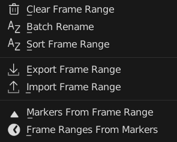
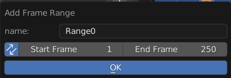
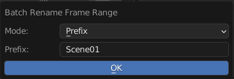
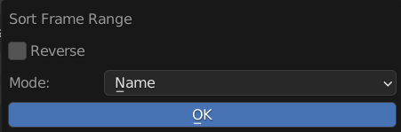
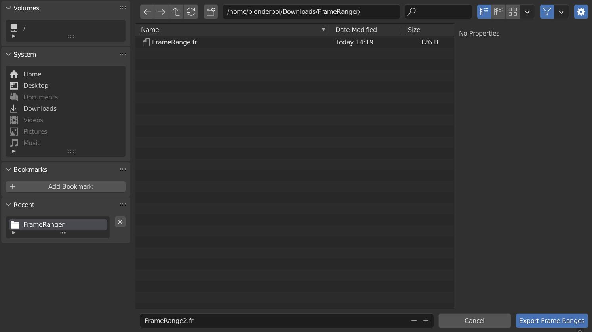
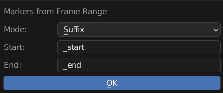
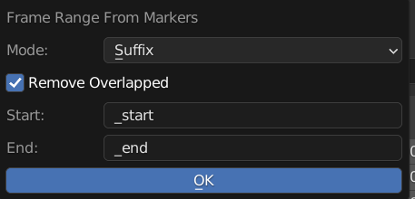

Menu Operators
==============

Operators to Manage Frame Ranger List, Find Next to the Frame Range List

Add Frame Range 
-----------------

Add Frame Range to List

**Name**: Name of the New Frame Range

**Sync**: Also Update Scene Frame Range Live 

**Start**: Start Frame

**End**: End Frame

---------

Clear Frame Range 
-----------------

Remove All Frame Range From List

---------

Batch Rename
------------

Batch Rename All the Frame Range in List, Adding Prefix, Suffix, or Find and Replace

**Mode**: Method of Rename

  - Prefix: Prepend String A to the Start of the Name

  - Suffix: Append String A to the End of the Name 

  - Find and Replace: Find String A and Replace with String Batch

**String A (Prefix / Suffix / Find)**: Use for Prefix, Suffix, and Find 

**String B (Replace)**: Stirng to be Replaced

---------

Sort Frame Range
----------------

Sort Frame Range in the List to be in Order

**Reverse**: Sort in Reverse Order
  
**Mode**: Sort By Method

  - Name: Sort by Frame Range Name
  - Range Size: Sort by Frame Range Size

---------

Export & Import Frame Range
---------------------------

Export or Import Frame Range from or to scene

The File Exported is Actually a json File, but the Extension is .fr so that it will be easier to be identified

---------

Markers From Frame Range
------------------------

Creates Timeline Markers From Frame Range List

  
**Mode**: Sort By Method

  - Pair: Starting and End Marker will use the Same Name 
  - Prefix: Prepend Prefix to Start and End to the Created Marker 
  - Suffix: Append Suffix to Start and End to the Created Marker 

**Start**: String to use adding Affixes on the Start Marker

**End**: String to use adding Affixes on the End Marker

Frame Range From Markers
------------------------

Creates Frame Range From Detected Timeline Markers 

  

**Mode**: Sort By Method

  - Pair: Find Marker Pairs with Same Name 
  - Prefix: Find Marker Pairs Using Prefix 
  - Suffix: Find Marker Pairs Using Sufix 

**Remove Overlapped**: Remove Overlapped Marker that have the same name Before Operation

**Start**: Affixes of the Start Marker to be found

**End**: Affixes of the End Marker to be found 

