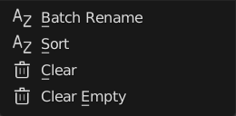
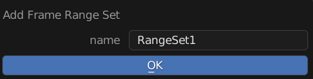
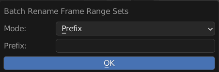
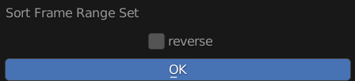

Menu Operators
==============

Operators to Manage Frame Ranger Set

---------

Add Frame Range Set
-------------------

Add a New Frame Range Set

**Name**: Name of the New Frame Range Set

---------

Batch Rename
------------

Batch Rename All the Frame Range Set, Adding Prefix, Suffix, or Find and Replace

**Mode**: Method of Rename

  - Prefix: Prepend String A to the Start of the Name

  - Suffix: Append String A to the End of the Name 

  - Find and Replace: Find String A and Replace with String Batch

**String A (Prefix / Suffix / Find)**: Use for Prefix, Suffix, and Find 

**String B (Replace)**: Stirng to be Replaced

---------

Sort Frame Range Set
--------------------

Sort Frame Range Set by Name in the list

**Reverse**: Sort in Reverse Order
  
---------

Clear
-----

Clear All Frame Range Set

---------

Clear Empty
-----------

Clear Frame Range Set that has no Frame Range

