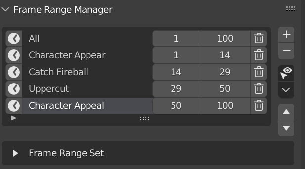
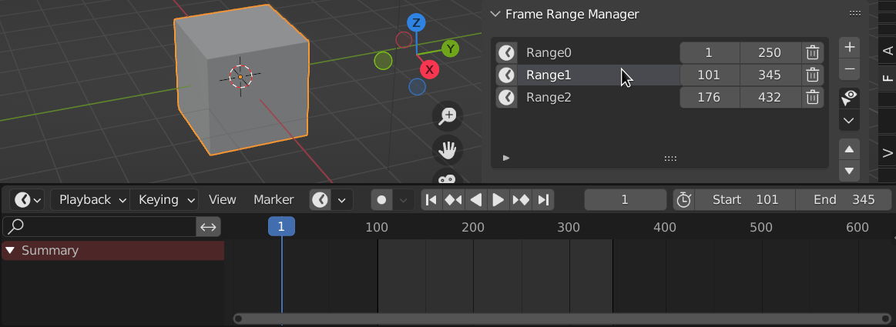

Frame Range Manager
+++++++++++++++++++

Getting Started
---------------

When You Open Blender in A Fresh New Blend File, You Will Need to Start by Adding A New Frame Range Set

Frame Ranger will Prompt You to Add Frame Range Set. 

This prompt will appear when there is no Frame Range Set found in Scene

Click the Add Frame Range Set Button to Get Started

Behaviour
---------

Setting the Active Item in the List will Update the Scene's Frame Range

.. note::
  When Setting Frame Range using Frame Range Manager, it will automatically turn off Auto Frame Range so that it won't fight with it. 

Frame Range List
----------------

Frame Range Manager is a List that Stores Frame Range So That you can Switch to it on a later time Easily

It Can Be Useful to split your animation into smaller easy to work with chunks when animating, allow you to work on a smaller area without manually typing in the frame range. 

.. toctree::
  :maxdepth: 2

  FRM_Menu_Operator.rst
  FRM_List_Item.rst

Frame Range Set
---------------

Each Frame Ranges is Stores in a Frame Range Set, think of it as a Group of Frame Ranges.

By Using Frame Range Set, You Can Create Multiple Groups of Frame Ranges and change them depending on which one you need. 

.. toctree::
  :maxdepth: 2

  FRSet_Menu_Operator.rst
  FRSet_List_Item.rst

Preferences
-----------

You Can Enable / Disable, Rename Category, and Rename Label in Preferences

  - Default Category: Frame Ranger

  - Default Label: Frame Range Manager 

Import Menu 
-----------

You Can Find Import Frame Range in the Import / Export Menu

You Can Enable to Show Import / Export Frame Range in Import / Export Menu in the Preferences

