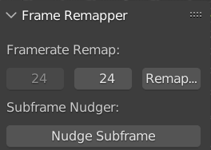
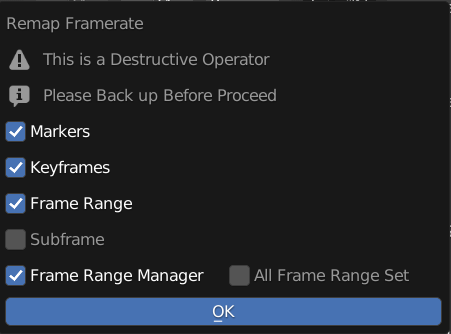
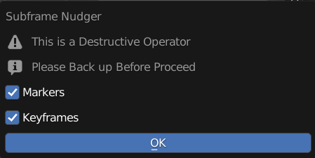
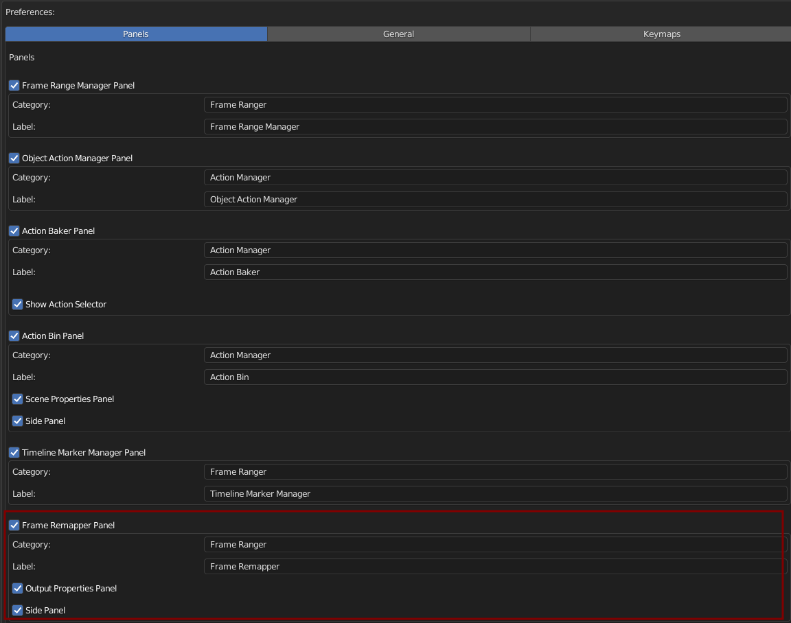

Framerate Remapper
------------------

A Destructive Tool that Remaps all the keyframes in this scene to different frame rate

FPS From
========

Current FPS, FPS remap From, this is View Only

FPS To 
======

FPS to be Remap to

Remap Framerate
===============

Remap Keyframes in this Blend File to the target framerate

**Markers**: Remap Markers

**Keyframes**: Remap Keyframes

**Frame Range**: Remap and Update Frame Range

**Subframe**: Use Subframe when available

**Frame Range Manager**: Remap Frame Ranges in Frame Range Manager 

**All Frame Range Set**: Remap All Frame Range Set (Will Only Remap Current Frame Range Manager if Off)

.. warning::

  This is a Destructive Operator

  Please Backup Before Proceed

Nudge Subframe
==============

Nudge Keyframes From Subframe to on Proper Frame

**Markers**: Nudge Markers

**Keyframes**: Nudge Keyframes

.. warning::

  This is a Destructive Operator

  Please Backup Before Proceed

Preferences
==============

You Can Enable / Disable, Rename Category, and Rename Label in Preferences

  - Default Category: Frame Ranger

  - Default Label: Frame Remapper

