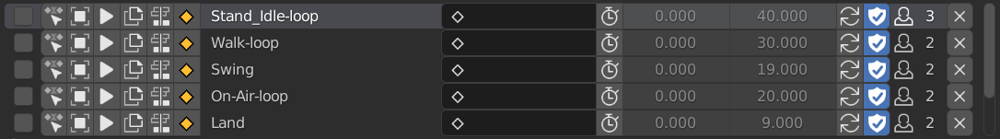
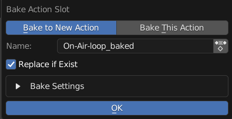

List Items 
==========

Items in the Frame Range Listbox

---------

Selection
---------

Select State Use for Bake Selected Actions, Push All to NLA, and Action Baker

---------

Set Active Slot
---------------

Set Current Active Slot 

---------

Select Object
-------------

Select Object with this Action
  
**Click**: Only Check Active Action 
**Shift Click**: Check All Slots 

---------

Play
----

Play This Action

**Click**: Play Action, Pause if is playing and is on the Same Action, Set Frame to Start if is not on Same Action or current frame out of frame range
**Shift Click**: Move to Frame Start and Play Animation

---------

Duplicate
---------

Duplicate this Action and Load to Object

---------

Push to NLA
-----------

Push this Action to NLA

---------

Bake Action
-----------

Bake this Action

**Bake to New Action / Bake to Self**: Bake action into a new action, or bake to current action

**Name**: Name of Baked Action, Automatically Set to Action's Bake Name By Default

**Use Action**: Use Action Picker instead of String Input, Useful if you want to Replace Action

**Replace if Exist**: Replace Action if Already Exist Action with Name

**Bake Settings**: Same Settings with the Blender Build in Bake Operator

---------

Name
----

Action's Name

---------

Bake Name
---------

Name Used for Baking, Hidden In Misc Settings in Action Settings

---------

Frame Range
-----------

Frame Range of the Action

**Use Manual Frame Range**: Enable to use Custom Frame Range

**Frame Start**: Start Frame, Cannot be Edited if Use Manual Frame Range is Off 

**Frame End**: End Frame, Cannot be Edited if Use Manual Frame Range is Off 

---------

Use Cyclic
----------

Action's Use Cyclic Setting

---------

Fake User
---------

Fake User State of Action

---------

Users
-----

The Amount of Users of Action

Remove
------

Remove Action Slot or Action

**Click**: Remove From Slot

**Shift Click**: Remove Action From Blend File As Well 

    .. image:: images/RemoveActionAlso.png

    - This Menu Only Pop up on Shift Click

    **Clean Up**: Remove Missing Action Slot From other Objects in this Blend File
