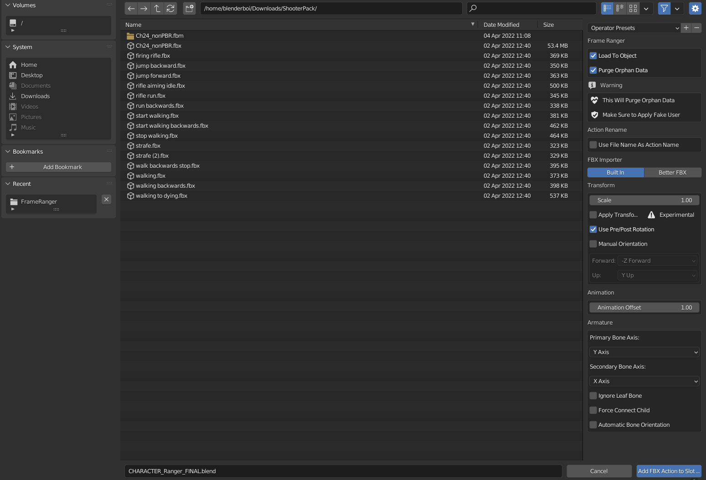
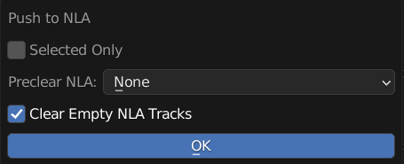
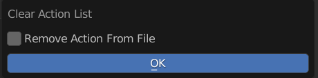

Menu Operators
==============

Operators to Manage Object Action List

---------

Add New Action
--------------

Add New Empty Action to this Object

**Name**: New Action Name

**Sync**: Also Update Scene Frame Range Live

**Manual Frame Range**: Use Manual Frame Range

**Manual Frame Range = True**

  **Start**: Start Frame 

  **End**: End Frame 

**Use Fake User**: New Action Will Use Fake User 

---------

Import And Load FBX Actions
---------------------------

A Wrapper Operator for Import FBX, Also Have Options to Use BetterFBX for Importing if is installed

It Will Import the FBX and Remove All the Imported Items except Actions

The Action is Then Loaded to the Object

**Use File Name as Action Name**: Imported Action Will Use Its own File name, Useful for importing in Mixamo Animation

**FBX Importer**: Import Method 

  - Build In: Uses Build in FBX importer 

  - BetterFBX: Uses BetterFBX if Better FBX is Installed. 

**Import Settings**: These is the Same as either import fbx settings or betterfbx settings. 

.. warning::
   This Operator Will Remove Orphan Data, Make Sure all wanted data are not orphan data

---------

Choose and Append Blend File Action
-----------------------------------

Pick and Choose Action from **One Blend File** to Append From and Load to this Object

After Choosing a blend file, a pop up similar to Action Loader will appear, You can Pick and Choose which action to append by clicking on the action

Search Filter Also works like Action Loader

---------

Append All Actions From Multiple Blend Files
--------------------------------------------

Append All or Filtered Actions From **Multiple Blend Files** and Load to Action

**Use Filter**: Enable Filter

**Use Filter**: Filter Appended Action

**Include / Exclude**: Filter Method

  - Include: Check if Action Name Include Filter String 

  - Exclude: Check if Action Name Exclude Filter String 

---------

Load Multiple Actions
---------------------

Operator Version of Action Loader, Loads Filtered Existing Action in Blend File

**All, Name Include, Name Exclude**: Filter Method 

  - All: No Filter

  - Name Include: Check if Action Name Include Filter String 

  - Name Exclude: Check if Action Name Exclude Filter String 

**Filter String**: Filter String 

**Detected Action**: Preview Detected Actions that will be loaded to the object when after running operator 

---------

Load Single Actions
---------------------

Load One Action to Object

**Action**: Action to Load

---------

Push All Action to NLA
----------------------

Push All Action in Object Action Manager to NLA

**Selected Only**: Only Push Selected Action in the List 

**Preclear NLA**: Method of Dealing with Existing NLA Strips 

  - Skip Push if Exist: Skip Pushing Action if the Action Already in NLA 

  - Clear All NLA Tracks: Clear All NLA Tracks Before Pushing 

  - None: Do Nothing 

**Clear Empty NLA Tracks**: Remove NLA Tracks if Empty 

---------

Batch Rename Actions
--------------------

Batch Rename All the Actions in List, Adding Prefix, Suffix, or Find and Replace

**Mode**: Method of Rename

  - Prefix: Prepend String A to the Start of the Name

  - Suffix: Append String A to the End of the Name 

  - Replace: Find String A and Replace with String Batch

  - Remove: Remove String A from Name 

**String A (Prefix / Suffix / Find)**: Use for Prefix, Suffix, Find and Remove

**String B (Replace)**: Stirng to be Replaced

---------

Sort Action Slot
----------------

Sort Action Slot in Order

**Reverse**: Sort in Reverse Order
  
**Mode**: Sort By Method

  - Name: Sort by Action Name
  - Range Size: Sort by Action Frame Range Size

---------

Clear Action List
-----------------

Clear All Action in List

**Remove Action From File**: Also Remove Action from Blend File instead of Just Unload from object
  

---------

Remove Action By Condition
--------------------------

Remove Action from List By Condition

**Condition**: Condition to Remove Action

  - Name: Sort by Action Name
  - Range Size: Sort by Action Frame Range Size
    

**Condition = Name**
  **Include / Exclude**: Filter Method

    - Name Include: Check if Action Name Include Filter String 

    - Name Exclude: Check if Action Name Exclude Filter String 

**Condition = Range Size**

    - **Operator**: Type of Operator for Comparison 

        - Greater or Equal: Match if Action Frame Range Size is Greater or Equal than Search Size

        - Lesser or Equal: Match if Action Frame Range Size is Lesser or Equal than Search Size

        - Equal: Match if Action Frame Range Size is Equal than Search Size

    - **Frame Range Size**: Frame Range Size Use to Compare 

**Use Curve Frame Range**: Ignore Manual Frame Range 

**Remove Action**: Also Remove Action from Blend File instead of Just Unload from object

**Deteced Action**: Preview Detected Actions that will be removed

---------

Clean List
----------

Remove Action Slot with Missing Action

---------

Fake User On
------------

Turn On All Fake User of Action in Object's Action List

---------

Fake User Off 
-------------

Turn Off All Fake User of Action in Object's Action List

---------

Bake Selected Actions
---------------------

Bake Selected Actions in the Object Action List

**Bake to New Action / Bake to Self**: Bake action into a new action, or bake to current action

**Replace if Exist**: Replace Action if Already Exist Action with Name

**Move Slot to Bottom**: Move Baked Action to the Bottom of the List

**Rename**: Rename Settings for Baked Action

  - Prefix: Prepend String A to the Start of the Name

  - Suffix: Append String A to the End of the Name 

  - Replace: Find String A and Replace with String Batch

**String A (Prefix / Suffix / Find)**: Use for Prefix, Suffix, Find and Remove

**String B (Replace)**: Stirng to be Replaced

**Use Bake Name When Available**: Uses Bake Name in Misc Settings of Action if is not empty

**Use Fake User**: Enable Fake User for Baked Action

**Bake Settings**: Same Settings with the Blender Build in Bake Operator

---------

Duplicate and Replace All Slot
------------------------------

Duplicate All Action in the List and Replace it All in Slot

Useful when you want to make a variation set of animation

**Mode**: Rename Method

  - Prefix: Prepend String A to the Start of the Name

  - Suffix: Append String A to the End of the Name 

  - Replace: Find String A and Replace with String Batch

**String A (Prefix / Suffix / Find)**: Use for Prefix, Suffix, Find and Remove

**String B (Replace)**: Stirng to be Replaced

**Use Fake User**: Enable Fake User for Baked Action
