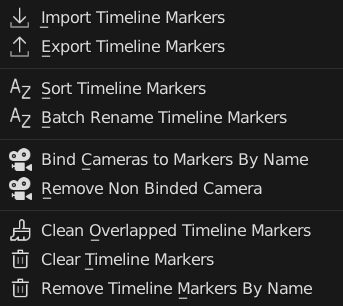
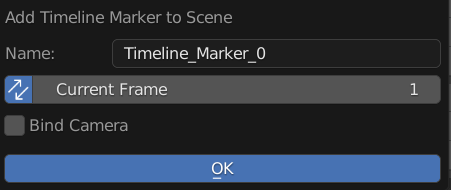
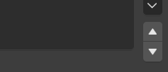
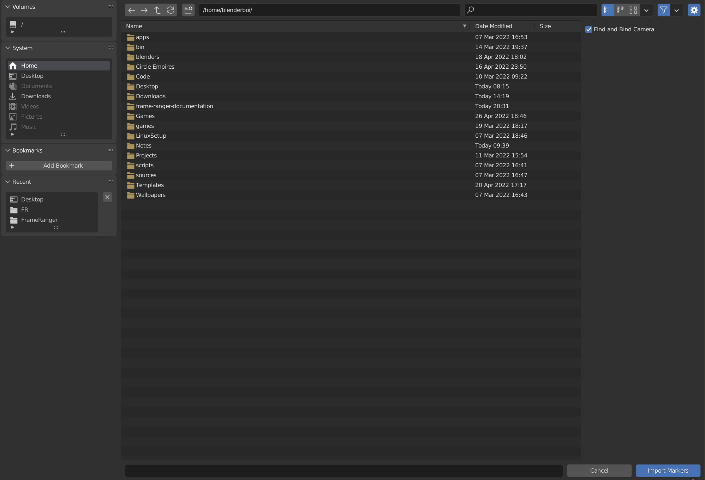
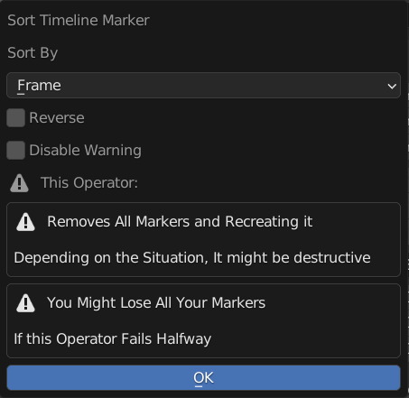
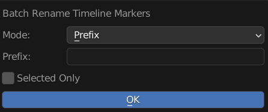
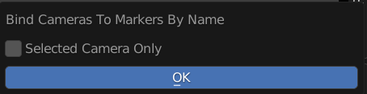
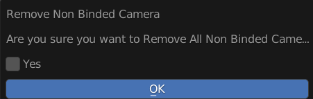
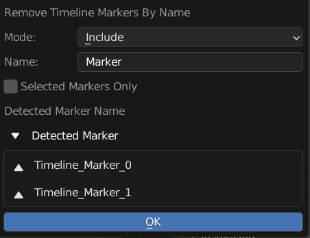

Menu Operators
==============

Operators to Manage Object Action List

---------

Add Timeline Marker 
-------------------

Add New Timeline Marker to this Action

**Name**: New Timeline Marker Name 

**Sync**: Also Update Current Frame Live

**Frame**: New Pose Marker Frame

**Bind Camera**: Bind A Camera to this Timeline Marker 

**Camera Mode**: Camera to Bind

  - Create From View
  - Active Camera
  - Camera

**Camera Mode = Create From View**
  
  Create A New Camera From View And Bind to Marker

  - Set Camera Name: Enable to Set Created Camera Name (Use Marker Name if Off)
  - Camera Name: New Camera Name
  - View Camera: View Camera After Creation

**Camera Mode = Camera**

  Pick an Existing Camera to Bind to Marker

  - Camera: Camera Picker to Bind to Marker
  - Only Camera: Limit Picker to only Pick Camera Object
  - View Camera: View Camera After Creation

**Camera Mode = Active Camera**

  Pick Selected Active Camera to Bind to Marker

  - View Camera: View Camera After Creation

Reorder Timeline Marker 
-----------------------

Reorder Timeline Markers in the List

.. warning::

  This Operator Is A Hacky Feature, It works By Remove All Markers and Recreating it. 

  It Might be Destructive if it breaks

  You Might Lose Your Marker if this Operator Fails Halfway

---------

Export & Import Timeline Marker
-------------------------------

Import / Export Timeline Marker to This Scene 

**Import**
  **Find and Bind Camera**: Find Relevant Camera and Bind to Marker (By Name)

The File Exported is Actually a json File, but the Extension is .marker so that it will be easier to be identified

.. note::

  Timeline Marker and Pose Marker Can be Imported or Exported Interchangebly

  They are technically the same type of object

  The only difference is pose marker is stored in Action and Timeline Marker is stored in scene

  And Binding Pose Marker to Camera Doesn't Seems to Have Any Uses Compare to Timeline Markers

Sort Timeline Markers
---------------------

Sort Timeline Markers By Name or Frame

.. warning::

  This Operator Is A Hacky Feature, It works By Remove All Markers and Recreating it. 

  It Might be Destructive if it breaks

  You Might Lose Your Marker if this Operator Fails Halfway

**Sort By**: Sort method 

  - Frame: Sort the List Base on Marker's Frame

  - Name: Sort the List Base on Marker's Name

**Reverse**: Reverse the Sort

**Disable Warning**: Disable The Warning

---------

Batch Rename Marker
-------------------

Batch Rename All the Timeline Markers of this Scene, Adding Prefix, Suffix, or Find and Replace

**Mode**: Method of Rename

  - Prefix: Prepend String A to the Start of the Name

  - Suffix: Append String A to the End of the Name 

  - Find and Replace: Find String A and Replace with String Batch

**String A (Prefix / Suffix / Find)**: Use for Prefix, Suffix, and Find 

**String B (Replace)**: Stirng to be Replaced

**Selected Only**: Only Rename Selected Markers

---------

Bind Cameras To Markers By Name
-------------------------------

Find Cameras and Bind it to Markers By Name

**Selected Camera Only**: Only Find Cameras From Selected Object

---------

Remove Non Binded Camera
-------------------------------

Remove All Camera that is not Binded to Timeline Markers

**Prompt**: This is Just a Confirmation Prompt 

.. warning::
  
  This Operator Mass Delete Objects, It Can be Destructive

---------

Clean Overlapped Timeline Markers
---------------------------------

Remove All Overlapping Duplicates of Timeline Marker with Same Name And Frame

---------

Clear Markers
-----------------------------

Remove All Pose Markers From this Action

---------

Remove Timeline Markers By Name
-------------------------------

Remove Timeline Marker If there is a Match In Name

**Mode**: Method of Matching 

  Include: Check if the input string is in the Timeline Marker name 

  Exclude: Check if the input string not in the Timeline Marker name 

  Exact: Check if the input string is exactly equal to the Timeline Marker name 

**Name**: Input String For Find Matching Pose Marker 

**Selected Markers Only**: Only Remove Selected Pose Marker 

**Detected Marker**: Preview Of Markers that will be deleted

