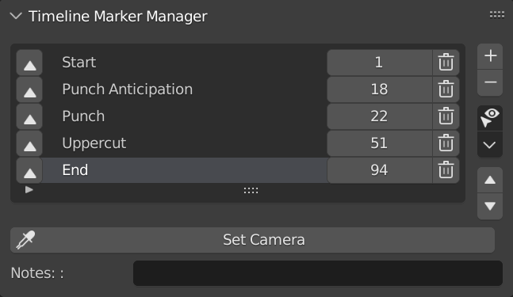
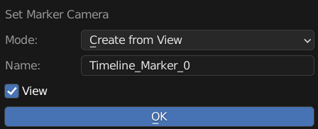
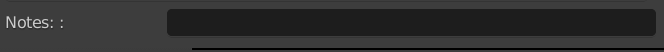
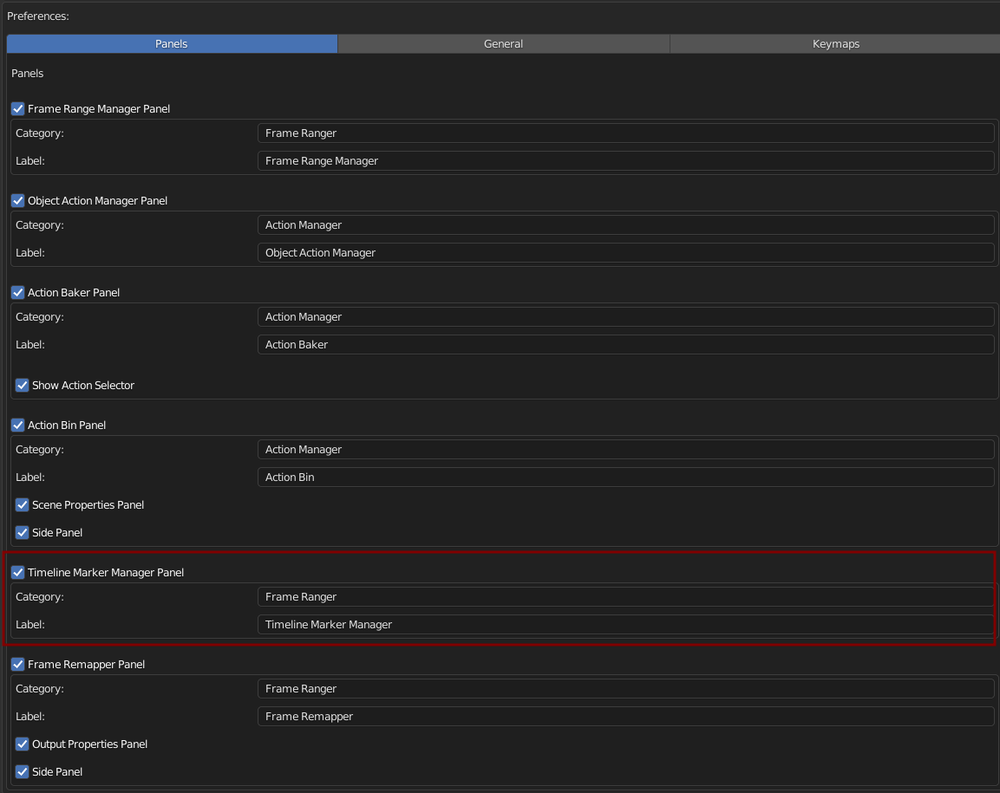
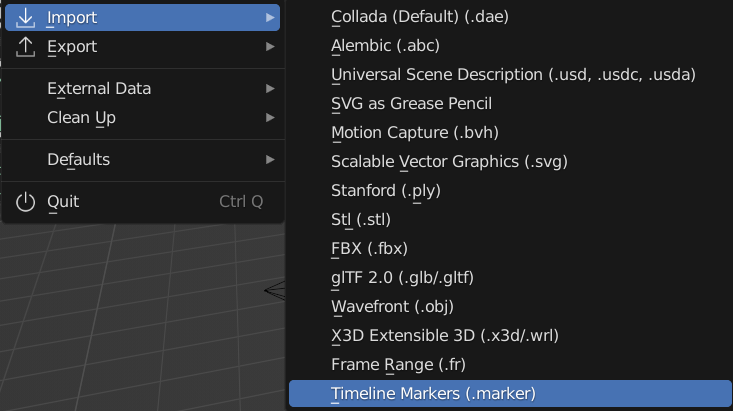
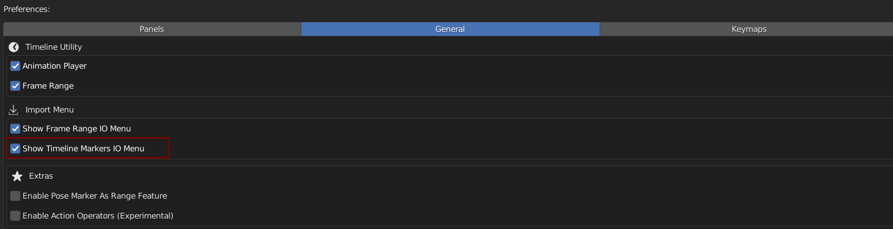

Timeline Markers Manager
++++++++++++++++++++++++

Timeline Markers List Present Timeline Markers in a List Form, making it easier to manage.

.. toctree::
  :maxdepth: 2

  TM_Menu_Operator.rst
  TM_List_Item.rst

Set Camera
----------

Bind Camera to Timeline Marker, Use to Switch Scene Camera

**Mode**: Camera to Add

  - Create Camera From View: Create Camera From View
  - Active Camera: Active Selected Camera
  - Camera: Pick Camera

**Mode = Create From View**: 

  - Name: New Camera Name
  - View: View Camera After Creation

**Mode = Camera**: 

  - Show All Object: Camera Picker no Longer Limit to Camera Object 
  - Camera: Camera to Bind to Marker 

---------

Notes
-----

Just a String Field For you to Write Comments or Notes 

Preferences
-----------

You Can Enable / Disable, Rename Category, and Rename Label in Preferences

Default Category: Frame Ranger

Default Label: Timeline Marker Manager 

Import Menu 
-----------

You Can Find Import Timeline Markers in the Import / Export Menu

You Can Enable to Show Import / Export Frame Range in Import / Export Menu in the Preferences

